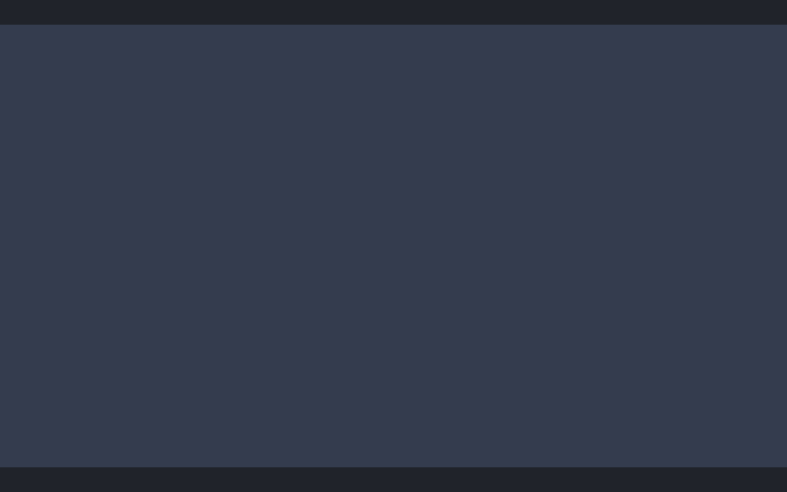
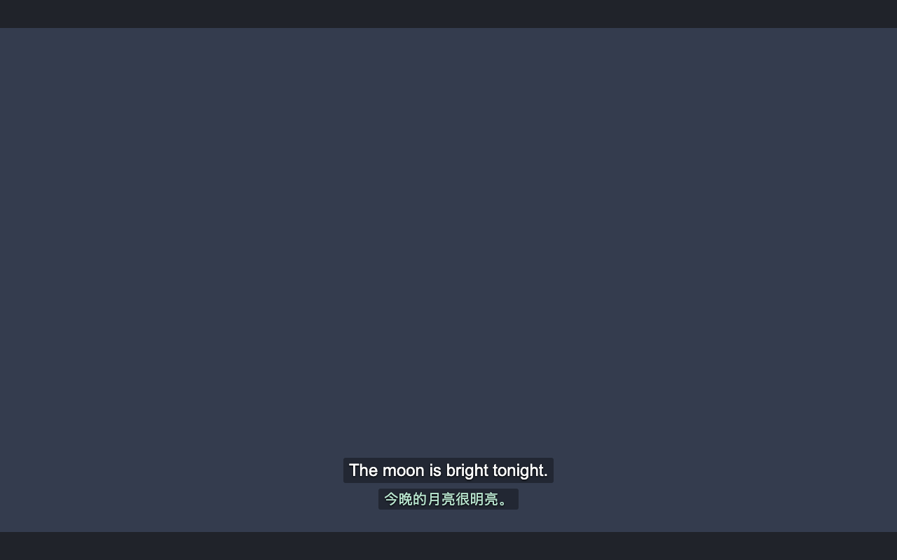
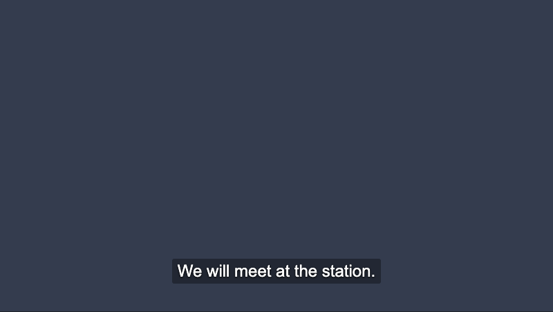
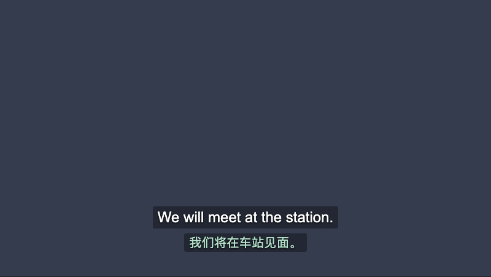

# E 类第 3、4 步：浏览器回归与真实平台验收记录

日期：2026-10-04（PDT）。代码基线：`e17a718`，即 PR #6 前两步之上的工作树；本记录随同一 PR 提交。

**结论：首批浏览器回归已纳入 `npm run verify`（YouTube/HBO 各 12 个场景）；真实登录态 YouTube/HBO 已在最终构建上完成现场验收，包括自动字幕和真实 Provider 出错后恢复；后台自然休眠和 40 秒慢 Provider 由不附着 worker 的独立检查验证。过程中发现并修复两个产品缺陷：暂停拖动后已缓存译文空白、YouTube 全屏时双语字幕完全不可见。**

## 1. 构建与环境

| 项            | 值                                                                                                                                                         |
| ------------- | ---------------------------------------------------------------------------------------------------------------------------------------------------------- |
| 最终构建      | `dist/` SHA-256 `7f8d5dab706c37624ac84612e04352d18d6b550c388c3e8df719367370f3e464`（与 e2e `build.json` 附件同一算法：按相对路径排序，依次摘要路径与内容） |
| 早期构建      | `f5764ee63df90a08028c8180d90db8d8a5b9c011d827c48643cbf07d750ed899`：只含缓存修复，用于发现全屏缺陷的首轮 YouTube 检查                                      |
| 自动化浏览器  | Playwright 1.63.0 配套 Chromium 153.0.8010.12，独立临时 profile                                                                                            |
| 现场浏览器    | 本机 Google Chrome 154.0.8037.93，用户个人 profile，Chrome DevTools MCP 连接                                                                               |
| 现场扩展      | `iebcfmkjbnpfmicpepkcejgmgmfihpam`，从本仓库 `dist/` 加载；每次构建后重载扩展并刷新对应标签页                                                              |
| 现场 Provider | 用户已配置的 `gemini-3.8-flash-high`；本轮现场检查期间扩展累计 Token 由 202.3K 增至 209.9K                                                                 |

现场记录不保存 Cookie、Authorization、签名查询参数或账号信息。现场截图含受版权保护的画面，只留在本机 `.artifacts/live/`；第 6 节的修复前后对比图由受控播放器生成。

## 2. 第 3 步：浏览器回归（纳入 verify）

`e2e/harness.ts` 负责启动、路由、Provider 夹具和诊断附件；`e2e/extension.spec.ts` 每个平台运行以下 12 个场景，共 24 例。播放器使用支持 Range 请求、可 seek 的 90 秒 WebM；页面夹具逐帧记录字幕层可见内容及 `video.currentTime`，用于检查中途闪错。

| 方案中的首批场景          | 浏览器用例                                                                 | 关键断言                                                                                                                                                             |
| ------------------------- | -------------------------------------------------------------------------- | -------------------------------------------------------------------------------------------------------------------------------------------------------------------- |
| 完整链路                  | packaged extension translates a source track through its worker            | 打包页面脚本读取原文；Provider POST 来自扩展 worker；恰好一个字幕层                                                                                                  |
| 长句切分＋延迟、仅改字号  | delayed split stays hidden and style changes preserve in-flight work       | 未就绪时不闪现整条长句；改字号保留字幕层、请求和源下载；逐帧原文译文成对                                                                                             |
| 暂停 / 恢复 / 缓存复用    | pause permits completion, seek and resume reuse completed cache            | 暂停时已发请求可完成；暂停拖动显示缓存译文；不重复 POST、不重复下载                                                                                                  |
| seek / 换视频旧响应晚到   | a late response cannot overwrite a new SPA video                           | 新视频译文先到，旧响应后到也不能覆盖                                                                                                                                 |
| 字幕语言和轨道切换        | source and selected tracks change without consuming website translations   | 切换 ASR、网站目标语言轨道、源语言；从不下载网站目标语言轨道；HBO 关闭字幕清空字幕层                                                                                 |
| 暂停时未缓存内容          | paused uncached content waits for resume                                   | 暂停期间不发起新翻译，恢复后再请求                                                                                                                                   |
| 开关、全屏、扩展重载      | fullscreen, disable and extension reload restore native captions           | YouTube 夹具对 `<html>` 全屏、HBO 夹具对播放器容器全屏；1 秒逐帧采样字幕始终在视频下半区；关闭和重载后原生字幕恢复；刷新后重新接管                                   |
| 兼容重试与实际发送        | compatibility retry uses actual worker HTTP and finishes                   | 400 后去掉 `response_format` 重发同一输入并完成                                                                                                                      |
| 草稿 JSON＋最终 JSON      | a draft before the final JSON never reaches the overlay or cache           | 字幕层和暂停拖动读取的缓存都只出现最终译文                                                                                                                           |
| 后台终止后恢复            | a stopped worker restarts on new page demand                               | CDP `ServiceWorker.stopWorker` 后观察到 `running → stopped → running`，新页面需求完成翻译                                                                            |
| Provider 出错：密钥无效   | an invalid key shows a safe error and recovers once fixed                  | 夹具 Provider 校验密钥，返回 401 并在错误体中回显密钥；字幕层只显示 `Subline：API Key 无效或已过期。` 或退避提示，不出现密钥或原始错误；改回正确密钥后无需刷新即恢复 |
| Provider 出错：暂时不可用 | a transient Provider failure recovers after backoff without extra requests | 首次请求 503 时只显示 `Subline：接口返回 HTTP 503，请稍后重试。` 或退避提示；15 秒退避内不再发请求；之后自动重试成功，请求序列恰为 503、200                          |

### 定向失败证据

同一断言先在缺陷构建上变红，再随修复变绿：

| 缺陷                   | 缺陷构建                                | 失败表现                                                             |
| ---------------------- | --------------------------------------- | -------------------------------------------------------------------- |
| D：草稿与最终双 JSON   | `44902dd`（D 修复前）临时 worktree 构建 | 两平台字幕层显示 `草稿：The moon is bright tonight.`                 |
| 暂停拖动后缓存查询卡住 | `e17a718`（本次修复前）                 | 两平台暂停拖动后译文为空                                             |
| YouTube 文档全屏       | 本次全屏修复前                          | YouTube 原文位于 y=-74、译文 y=-30，HBO 通过                         |
| 页面脚本缺失           | `npm run test:e2e:detection`            | 两平台在“原文必须到达字幕层”处失败                                   |
| 设置更新后仍保留退避   | 临时删除 `queue.reset()` 中的退避清零   | 两平台改回正确密钥后仍显示 `Subline：接口暂不可用，稍后将自动重试。` |
| 原样展示 Provider 错误 | 临时让错误文本直接使用响应体            | 两平台字幕层显示 `Incorrect API key provided: e2e-invalid-key`       |

### 测试环境发现

Playwright 默认参数下，`chrome.runtime.reload()` 会使扩展停留在 `DISABLE_UNSUPPORTED_DEVELOPER_EXTENSION` 禁用状态，扩展页面返回 `ERR_BLOCKED_BY_CLIENT`。写 Preferences、去掉 `--disable-extensions`、CDP `Extensions.loadUnpacked` 均无效；在 `chrome://extensions` 实际打开开发者模式后，重载约 0.6 秒恢复。harness 因此在每个 profile 启动后点击该开关，这也与用户加载未打包扩展的真实条件一致。

## 3. 第 4 步：真实平台验收

`pass` 表示在最终构建上执行并符合预期；`fail → fixed` 表示首轮发现缺陷，修复后在最终构建复验通过；`not-run` 注明原因。

### YouTube（已登录）

视频：`H14bBuluwB8`（TED，人工英文字幕）；站内跳转到 `3iRUwVzRDZQ`（人工英文字幕）；`86uOQSO_qR0`（vlog，只有自动英文字幕 `a.en`）。

| 项               | 结果         | 证据                                                                                                                                                                                               |
| ---------------- | ------------ | -------------------------------------------------------------------------------------------------------------------------------------------------------------------------------------------------- |
| 注入与接管       | pass         | 字幕层挂在 `.html5-video-player`；原生字幕层 opacity 0                                                                                                                                             |
| 读取源轨道       | pass         | `timedtext` 请求 `lang=en&fmt=json3`，无 `tlang`，200                                                                                                                                              |
| 网站自动翻译打开 | pass         | YouTube 原生层为站方中文译文，扩展仍显示英文原文与模型译文，两者不同                                                                                                                               |
| seek             | pass         | 暂停拖动到 66/70/77 秒立即显示对应原文和缓存译文；73.5 秒原生字幕同样为空                                                                                                                          |
| SPA 切视频       | pass         | 原地导航到新视频，原文译文与原生字幕同步，无旧视频残留                                                                                                                                             |
| 播放器全屏       | fail → fixed | 首轮：YouTube 对 `<html>` 全屏，字幕层挂到高度为 0 的根元素，原文 y=-74、译文 y=-30，全屏时没有任何字幕；复验：字幕层留在播放器，2 秒内 244 次可见采样全部位于视频下半区                           |
| 关闭/开启扩展    | pass         | 弹窗开关关闭后无字幕层、原生字幕 opacity 1；重新开启后恢复，设置保持开启                                                                                                                           |
| 自动字幕（ASR）  | pass         | 在只有 `a.en` 的视频上，扩展请求 `kind=asr&lang=en&fmt=json3`、无 `tlang`，200；逐词流重组为整句，原文译文与原生自动字幕同步，如 `I love when baristas are nice.` / `我真的很喜欢态度好的咖啡师。` |

### HBO Max（已登录）

内容：Friends S1E3 `44805ae8-7771-4238-ad89-2c629a30db4d`；站内换集到 S1E1 后返回。

| 项                     | 结果 | 证据                                                                                               |
| ---------------------- | ---- | -------------------------------------------------------------------------------------------------- |
| DASH/WebVTT 读取与同步 | pass | 扩展页面脚本以 fetch 读取 `.mpd` 与 `t4/*.vtt`，均 200；连续采样原文译文成对                       |
| seek                   | pass | 播放中跳到 600 秒：原文即时出现，译文约 1.5 秒后到；暂停拖回已翻译位置立即显示缓存译文             |
| 字幕轨道切换           | pass | 选择站方简体中文字幕后，扩展继续读取英文原文并显示自身译文，与站方中文不同                         |
| 关闭字幕               | pass | 选择 Off 后不显示扩展字幕；切回 English CC 后恢复                                                  |
| 换集                   | pass | 站内切换到 S1E1，无整页导航，无上一集残留，原文译文同步                                            |
| 容器全屏               | pass | 全屏元素为 `playerContainer`；4 秒内 482 次可见采样全部位于视频下半区                              |
| 关闭/开启扩展          | pass | 关闭后无字幕层、原生字幕可见；开启后接管                                                           |
| 扩展重载清理           | pass | 重载扩展而不刷新标签页：旧内容脚本移除字幕层与 `subline-player`，原生字幕 opacity 1 并显示站方字幕 |

### 共用项

| 项                           | 结果    | 说明                                                                                                             |
| ---------------------------- | ------- | ---------------------------------------------------------------------------------------------------------------- |
| 设置更新传到视频页           | pass    | 两平台弹窗开关均实时生效                                                                                         |
| 真实 Provider 出错后恢复     | pass    | 见下文“Provider 出错恢复”                                                                                        |
| 自定义 Provider 首次域名授权 | not-run | 需要真实授权弹窗操作，未纳入本次                                                                                 |
| 现场 Chrome 后台自然休眠     | not-run | DevTools MCP 不能打开 `chrome://` 页面，其 worker 列表只增不减，无法证明停止；改在独立 Chromium 中验证（见下节） |

### Provider 出错恢复

在自动字幕视频的未翻译区间执行，用户配置原样恢复：

1. 在扩展页面内把设置备份到临时存储项，只向外返回设置摘要 `4578f739248ef57a`，密钥不离开浏览器。
2. 把 API Key 改为无效值后播放。原文照常显示；译文位置依次出现 `翻译中`、`Subline：接口暂不可用，稍后将自动重试。` 和 `Subline：API Key 无效或已过期。`，没有出现密钥或接口原始错误。
3. 从备份恢复设置，不刷新页面。约 2 秒后下一句恢复原文译文，之后 10 秒内没有错误。
4. 恢复后设置摘要仍为 `4578f739248ef57a`，临时备份已删除，扩展保持启用且已配置。

发现：预取请求先失败时，可见字幕在随后 15 秒退避内只显示通用的“接口暂不可用，稍后将自动重试”，真实原因（密钥无效）只偶尔出现。GitHub Actions 上的浏览器回归也出现了同一顺序：预取先失败，可见字幕显示退避提示，因此两个出错场景都接受“真实原因或退避提示”两种文本，其他内容一律判失败。恢复本身正常；是否在退避期间沿用上一次失败原因，属于提示文案决定，本次未改。

## 4. 后台生命周期：调试与休眠分开验证

| 方式                          | 是否附着 worker                                       | 结果                                                                                      |
| ----------------------------- | ----------------------------------------------------- | ----------------------------------------------------------------------------------------- |
| Playwright e2e                | 是，Playwright 自动附着全部 worker                    | 两平台 120 秒及空白页 75 秒内都没有自然停止，因此 e2e 只做 CDP 强制停止后的恢复           |
| `npm run test:e2e:lifecycle`  | 否，仅 `Target.setDiscoverTargets` 观察目标出现与消失 | worker 在最后一个事件后 30.1–30.2 秒自然停止；打开播放器页面后 308–352 毫秒重启并显示原文 |
| 同一检查中的 40 秒慢 Provider | 否                                                    | 请求期间 worker 未停止，只发出一次请求，译文送达页面                                      |

`test:e2e:lifecycle` 直接启动同版本 Chromium，用 `--host-resolver-rules` 把 `www.youtube.com` 指向本地 HTTPS 夹具（自签证书配合 `--ignore-certificate-errors`），因此整条链路没有任何 DevTools 附着到扩展 worker。Chrome 文档把“fetch 响应超过 30 秒”列为终止条件；本构建在 Chromium 153 下 40 秒未复现，超过应用 60 秒超时和 Chrome 154 正式版尚未测量。该检查耗时约 75 秒，不进入 verify。

## 5. 后续验收触发规则

- 改 YouTube 或 HBO 适配器：对应平台按第 3 节表格复验。
- 改 core、bridge、overlay、content、后台消息或 manifest/构建注入：两平台复验，并运行 `npm run test:e2e:lifecycle`。
- 发布候选：两平台完整清单，补做上表 not-run 项或注明原因。

## 6. 修复前后对比

图片由受控播放器在修复前构建和最终构建上生成，与浏览器回归使用同一夹具。

YouTube 文档全屏：修复前没有任何字幕，修复后原文译文位于视频底部。

| 修复前                                              | 修复后                                                     |
| --------------------------------------------------- | ---------------------------------------------------------- |
|  |  |

暂停后拖动到已翻译位置：修复前只有原文，修复后立即显示缓存译文。

| 修复前                                             | 修复后                                              |
| -------------------------------------------------- | --------------------------------------------------- |
|  |  |
