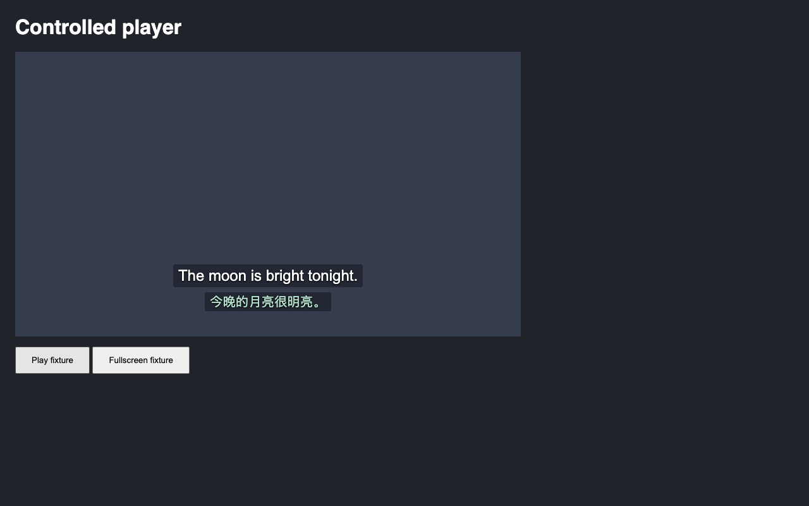

PR #11 的截断草稿回归已修复。旧版遇到未闭合的 `results` 对象就停止搜索，后面即使有完整最终 JSON，也会把草稿里的译文显示并缓存。现在会继续寻找后面的回复，同时跳过字符串和对象成员中的完整值，避免把未完成结果里的 `parts` 数组当成独立回复。

最小复现包含一条输入字幕，Provider 返回以下文本。第一份 JSON 故意缺少末尾的 `]}`。

```text
{"results":[{"id":0,"parts":[{"translation":"草稿"}]}
Final
{"results":[{"id":0,"parts":[{"translation":"最终"}]}]}
```

修复前返回并缓存 `草稿`，修复后返回并缓存 `最终`。另一标签页读取同一句时复用最终译文，总共只发一次 Provider 请求。

2026-10-05 本地验证结果如下。旧版测试使用 `1462efe` 的源代码或打包扩展，搭配本次新增的回归测试；旧版失败是对原问题的复现。

| 检查                       | 修复前                   | 修复后                                                             |
| -------------------------- | ------------------------ | ------------------------------------------------------------------ |
| Provider 回复与队列测试    | 7 失败，39 通过          | 46 通过                                                            |
| YouTube 截断草稿端到端用例 | 显示草稿，断言失败       | 显示最终译文，往返 seek 后仍使用缓存，1 次请求                     |
| HBO 截断草稿端到端用例     | 显示草稿，断言失败       | 显示最终译文，往返 seek 后仍使用缓存，1 次请求                     |
| `npm run verify`           | 本次只对旧版运行上述复现 | 静态检查、测试发现、337 个单元测试、构建和 29 个端到端测试全部通过 |

测试还覆盖未闭合的对象、截断的字段名和字符串，以及截断草稿后再次出现损坏或截断的最终 JSON。后一种情况只发布最终回复中完整的结果，不退回草稿。未完成结果里的 `parts` 数组不会单独发布。

截图来自同一个本地播放器夹具，加载真实打包扩展，Provider 使用固定回复。两平台逐帧采样都没有记录到修复后的草稿译文。后图在暂停并往返 seek 后截取，展示缓存中的最终译文。

| 修复前                                                   | 修复后                                                      |
| -------------------------------------------------------- | ----------------------------------------------------------- |
|  |  |

可重复运行的检查命令如下。

```sh
npm test -- tests/provider-responses.test.ts tests/queue.test.ts
npm run verify
npm run test:e2e -- --grep 'a truncated draft'
```

浏览器报告包含 `network.json`、`subtitles.json`、构建摘要和 `final-cached.png`。CI 的 `browser-results` 构件会保留这些证据。
