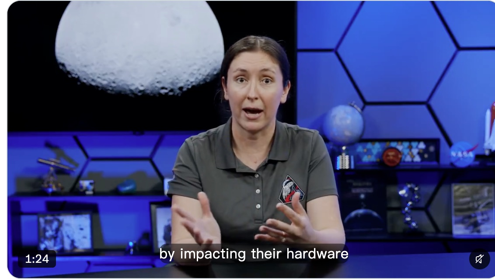
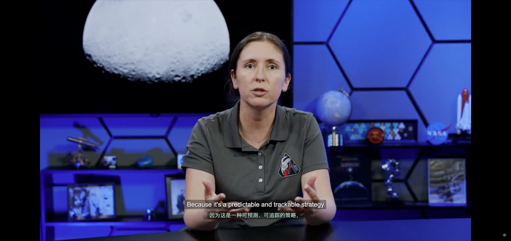

X（推特）视频加入双语字幕。加载流程与 YouTube、HBO 相同：MAIN 页面脚本提前取得原文时间轴，经 `src/core/bridge` 交给内容脚本，再按段预取、翻译，用同一个字幕层显示。

## X 播放器怎么提供字幕

2026-10-06 在已登录的 Chrome 中检查 X 当前播放器，结论如下。

- X 用 hls.js 1.6 播放视频。主播放列表用 `EXT-X-MEDIA:TYPE=SUBTITLES` 声明字幕轨道，字幕播放列表指向 `video.twimg.com/subtitles/...` 上的 WebVTT。看过的视频都只有一个 VTT 分段，2 分钟的视频也是。
- 播放器的 React context 中有 `playerApi.video.hlsJs`，即 hls.js 实例。`hls.url` 是主播放列表，`hls.subtitleTracks` 是轨道列表，`hls.subtitleTrack` 是当前选中轨道。点「隐藏字幕」后变为 `-1`，再点恢复为原序号。这与 HBO 从 React 状态读取清单地址和选中轨道的做法一致。
- X 的字幕由浏览器原生渲染：hls.js 建一条隐藏的 `subtitles` TextTrack，X 再复制一条 `captions`（label 为 `clone`）设为显示，页面上没有字幕 DOM。
- 时间线和帖子页常同时有多个 `<video>`。核心原来取第一个可见且未结束的视频，在 X 上可能落到已滚出视口的那个。

## 改动

- `src/platforms/x/`：`player.ts` 选当前视频（视口内可见面积最大，正在播放的优先；全屏时只看全屏元素内），并提供 TextTrack 回退；`captions.ts` 解析 HLS 字幕播放列表并只接受 `video.twimg.com`；`page.ts` 经 hls.js 选轨、下载、断句；`platform.ts` 实现 `Platform`。
- `src/core/platform.ts` 增加可选的 `findVideo`，控制器有它时用它选视频，YouTube、HBO 行为不变。
- HBO 的 WebVTT 解析、下载上限和多文件并发下载移到 `src/core/webvtt.ts`，HBO 和 X 共用。
- 视频身份是页面路径加当前 `<video>` 的 `currentSrc`。路径变化时和 YouTube、HBO 一样立即重置，避免沿用上一个视频的时间轴多发一次预取。
- 接管原生字幕时，核心样式此前只把 `::cue` 的文字和背景设为透明，Chrome 仍会画出半透明的字幕底框。现在同时隐藏 `::-webkit-media-text-track-container`，HBO 的 TextTrack 回退也受益。
- 设置页「支持的网站」加入 X 开关，默认开启；manifest 加入 `x.com`、`twitter.com`。

## 真实站点验收

扩展从本分支 `dist/` 加载到用户的 Chrome，Provider 为用户已配置的服务。视频：NASA 帖子 `2085101081260904717`（2 分 14 秒，英文字幕，无烧录字幕）。

| 检查                | 结果                                                                                                                      |
| ------------------- | ------------------------------------------------------------------------------------------------------------------------- |
| 读取与翻译          | 下载 1 个字幕播放列表和 1 个 VTT，69 条字幕合成 17 句，其中 13 句超过 80 列交给 Provider 切分。两段各一次请求，均返回 200 |
| 显示                | 字幕层挂在 `[data-testid="videoPlayer"]` 内，原文译文成对出现；X 原生字幕的文字和底框都不可见                             |
| 字幕开关            | 点 X 的「隐藏字幕」后约 1 秒字幕层清空，重新打开后从缓存恢复                                                              |
| 全屏                | X 对外层 div 全屏，字幕层随之进入全屏元素，位于画面下部                                                                   |
| 时间线多视频        | NASA 主页上播放第一个视频时字幕层在它的播放器内；滚到第二个视频并播放后字幕层移到第二个，页面始终只有一个字幕层           |
| 对照（同 Provider） | YouTube TED 视频正常翻译                                                                                                  |

用户的 Provider 处理长句较慢：两段请求分别耗时 51.9 秒和 33.4 秒，接近 60 秒超时。另一次运行中，第二段（7 句中 6 句需切分）超时，界面显示「接口请求超时」，退避后队列把失败项拆小重试并成功。这是现有的超时与重试行为，与平台无关，本次未改动。

| 原来（X 自带字幕）                              | 现在                                                   |
| ----------------------------------------------- | ------------------------------------------------------ |
|  |  |

全屏：

原生字幕底框。截图时暂时隐藏扩展字幕层，只看 X 原生字幕所在位置：

| 原来：文字透明，仍有半透明底框                          | 现在：底框也隐藏                           |
| ------------------------------------------------------- | ------------------------------------------ |
|  |  |

设置页：

| 原来                                                 | 现在                                               |
| ---------------------------------------------------- | -------------------------------------------------- |
|  |  |

900 像素宽时三项并排，600 像素宽时改为单列，与原有断点一致。

## 自动化验证

- 单元测试 `tests/x.test.ts`：两段预取、关闭和重新打开字幕、选中目标语言时改读原文轨道且不下载目标语言、多视频切换、全屏与已结束视频、换视频和关闭 X 开关时取消下载、读不到播放器时用 TextTrack 逐句翻译、地址与播放列表校验。
- 浏览器回归：X 加入全部 14 个共用场景，并与 HBO 共用「时间轴就绪前不显示未翻译原文」场景。夹具用假的 hls.js 实例和 `video.twimg.com` 路由提供 HLS 与 WebVTT。
- `npm run test:e2e:detection` 改为覆盖三个平台。它原先查找的断言文本在 `7be0451` 改名后已不存在，所以在 `main` 上一直失败；现在匹配当前的「Source timeline must be downloaded」，三个平台都在该断言处失败，检查通过。
- `npm run verify`：静态检查、测试发现、345 个单元测试、构建和 44 个端到端测试全部通过。
- `tests/captions.test.ts` 中「暂停时完成进行中的翻译」用例模拟约 2 分钟播放，单独运行约 2 秒，并行负载下偶尔超过默认 5 秒超时，改动前的基线运行也出现过。新增的 X 测试项目加重了并行负载，该用例的超时调为 15 秒，断言不变。
