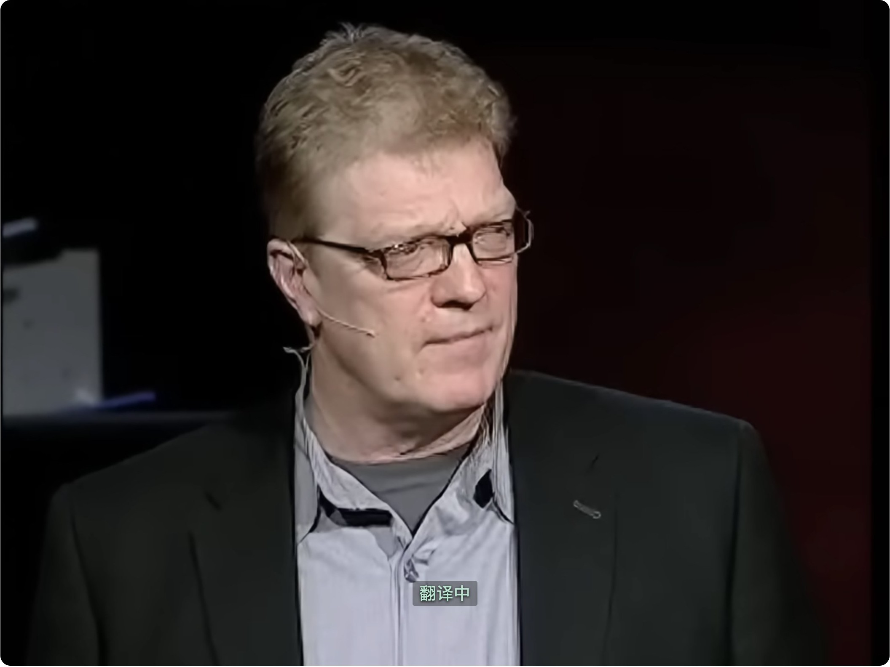
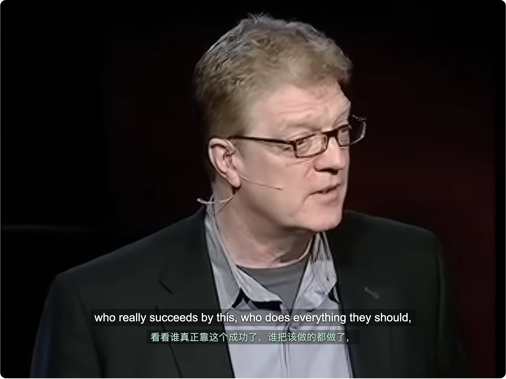
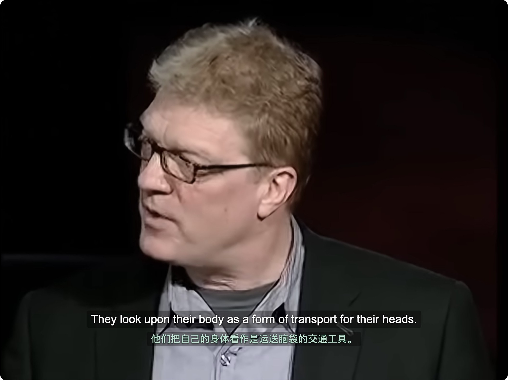

本次在用户已登录的 Default Chrome 中，通过指定的 `chrome-debug` skill 测试 YouTube。连续观看时发现译文等待和漏句，暂停后恢复的样本正常。首次播放的结果受视频缓冲和 YouTube 恢复观看进度影响，不能概括为所有视频首次打开都同步。

测试日期为 2026-10-07。Chrome 加载主仓库的 `dist`，本工作区重新构建后的 `background.js`、`youtube-content.js`、`youtube-page.js` 和 `manifest.json` 与已加载文件逐字节相同。测试使用现有 Provider 配置，播放速度为 1 倍，原文为英语，译文为中文。没有修改扩展功能或 skill，也没有提交或创建 PR。

| 场景 | 样本 | 结果 |
| --- | --- | --- |
| 首次打开，从头播放 | Angela Duckworth 演讲 `H14bBuluwB8`，播放约 121 秒 | 16 个输入字幕句全部就绪，字幕时间覆盖率 100%，计时延迟 p90 和最大值均约 0.1 秒。开头视频在 0 秒缓冲，首条译文在页面打开约 17.3 秒后出现，视频约 18.8 秒后开始推进。缓冲期间屏幕显示"翻译中"约 9.7 秒。 |
| 打开视频后恢复历史进度 | Ken Robinson 演讲 `iG9CE55wbtY`，YouTube 自动恢复到约 1:46 | 第一个就绪译文在视频约 1:50 出现，开头数句未能及时显示译文。这与从头播放的样本不同。 |
| 连续观看 | 同一 Ken Robinson 视频，实际连续播放约 481 秒，到约 9:47 | 覆盖率 91.3%，123 个输入字幕句中，8 句在长播采样内未见就绪译文。7 句在该窗口内结束，另 1 句在随后暂停期间完成。延迟 p90 约 0.1 秒，最大约 9.5 秒。11 次"翻译中"，累计约 36.7 秒。 |
| 暂停后恢复 | 视频约 9:47 暂停 30.2 秒，再播放约 45 秒 | 暂停期间视频时间始终为 587.137362 秒。暂停前的翻译请求在暂停期间完成。恢复时已有译文，随后 13 个输入字幕句全部就绪，覆盖率 100%，最大延迟约 0.1 秒，没有"翻译中"等待。 |

覆盖率只计算有输入字幕的时段，不把无字幕间隙算成缺译。计时事件统计输入字幕句，Provider 拆成多条显示字幕时，句数不等于屏幕字幕条数。页面另以 250 毫秒间隔记录视频状态和实际字幕层，用于核对启动等待与暂停行为。

连续观看没有出现延迟不断累积的趋势。视频 3:00 至 8:00 的分钟窗口覆盖率约 99.9% 至 100%，最大延迟约 0.1 秒。之后再次出现等待，8:00 至 9:00 的覆盖率降到约 83.7%。最慢字幕在视频约 8:35 开始，约 8:45 才显示译文。对应第 12 段请求耗时 48.19 秒，首条结果与整批完成几乎同时到达。这支持"部分翻译批次未能赶上播放"的判断，尚不足以区分 Provider、网络或流处理各自的影响。

暂停时尚未完成的译文可以继续完成，因此本次暂停前后的字幕文字发生变化。视频时间没有推进，出现的译文属于当前字幕。恢复后没有继续显示过期字幕的计时证据。该结果覆盖 30 秒暂停，计时采集会保持 service worker 活跃，没有验证 worker 休眠后或更长暂停后的恢复。

补充测试 Steve Jobs 演讲 `UF8uR6Z6KLc` 时，视频在约 2.9 秒进入暂停状态，`readyState` 为 4，没有持续播放。该检查在 270 秒总预算耗尽后失败，后续"译文已经就绪时暂停"的步骤未执行。已保留 [失败报告](../../.artifacts/live/youtube-sync/immediate-report.jsonl)，没有把该样本纳入字幕同步判断。暂停原因尚未查明，不能据此归因于翻译。







skill 的连接和清理流程好用。`live start` 一次就成功连接，后续重新加载和检查复用同一条 DevTools 连接，没有重复要求允许。检查只打开自己的标签页，并在结束时关闭。输出按步骤报告进度，计时数据能把屏幕等待关联到具体翻译段。限制扩展上下文读取、去掉请求查询参数的规则也写得明确。

使用中最需要改进的是验收判定。长播检查返回 `ok: true`，同时报告覆盖率 91.3%、8 句未就绪和 9.5 秒最大延迟。当前 `trace` 成功只表示完成采集，`wait-overlay` 成功只表示某一时刻出现译文，都不能代替同步验收。建议允许检查声明最大延迟、最低覆盖率和允许漏句数，并区分已经错过的句子与采样结束时仍在等待的句子。

首次播放还需要同时报告实际经过的时间和视频时间。本次开头实际显示"翻译中"约 9.7 秒，视频一直停在 0 秒，`stats.loading.seconds` 却是 0。建议分别记录导航、首次字幕可用、首次译文就绪、真正开始播放的时刻，同时记录缓冲、广告与视频进度。冷启动测量应明确是否从 0 秒开始，避免 YouTube 自动恢复历史进度改变测量含义。

暂停恢复应有现成动作和示例。内置 `play` 会在每次重试时自动恢复播放，直接在后续步骤调用 `video.pause()` 无法保持暂停。本次使用 `evaluate` 开始播放，暂停步骤据真实时间等待，不修改 `video.play` 或媒体行为。建议增加 `pause`、`wait`、`resume`，并让执行器在明确暂停期间停止自动播放。YouTube 检查示例也应直接包含字幕开启和偏好恢复，现有 smoke 示例没有这些步骤。字幕开启脚本还应排除语言切换提示，补测中它把"英语 - English 点击查看设置"当作字幕出现。

补测还暴露了这套临时做法的限制。`evaluate` 开始播放后，播放器后来进入暂停，执行器没有内置 `play` 的持续恢复能力。`trace` 只采到约 1 秒播放，却等待约 266 秒才失败。执行器需要同时支持"保持播放"和"明确暂停"，并在预期播放但视频不推进时及时结束。这样既能测暂停，也能避免检查卡住。

主 `SKILL.md` 有 153 行、约 2 万字符。大表格里的长段落让它比行数看起来更长。建议主文件保留操作顺序、连接和隐私限制、结果判定与几个常见入口，把动作字段、trace 实现和完整排障表移到参考文件。主文件缩短后只需几个跳转链接，无需再加长目录。

建议的目录可以沿用现有 `scripts` 和 `checks`，只增加参考文档和常见场景检查文件。

```text
chrome-debug/
  SKILL.md
  references/
    checks.md
    trace.md
    troubleshooting.md
  checks/
    smoke.json
    youtube-cold-start.json
    youtube-long-play.json
    youtube-pause-resume.json
  scripts/
    live.py
    holder.py
    worker_trace.py
```

`SKILL.md` 中的 `live` 是文档简称，不是实际安装的命令。快速开始最好给出可直接执行的 `python3` 命令，说明检查文件从仓库根目录运行，以及 `--path` 如何指定 Chrome 实际加载的扩展目录。长播场景还需要比默认短检查更长的可配置预算和视频停滞超时，避免唯一连接被长时间无进度的检查占用。

`npm run verify` 已通过，包括 lint、类型检查、测试发现、356 个单元测试、构建和 50 个端到端测试。真实站点结果来自用户 Chrome，端到端测试使用 CI 对应的隔离测试浏览器。

检查文件、原始报告和页面采样保存在 [测试目录](../../.artifacts/live/youtube-sync/)。主要证据为 [检查定义](../../.artifacts/live/youtube-sync/checks.json)、[执行报告](../../.artifacts/live/youtube-sync/reports.jsonl)、[长播计时](../../.artifacts/live/youtube-sync/long-trace.json)、[恢复计时](../../.artifacts/live/youtube-sync/resume-trace.json)、[页面采样](../../.artifacts/live/youtube-sync/long-dom.json) 和 [汇总分析](../../.artifacts/live/youtube-sync/analysis.json)。这些原始文件位于仓库忽略的 `.artifacts` 目录，当前工作区可以直接查看。
