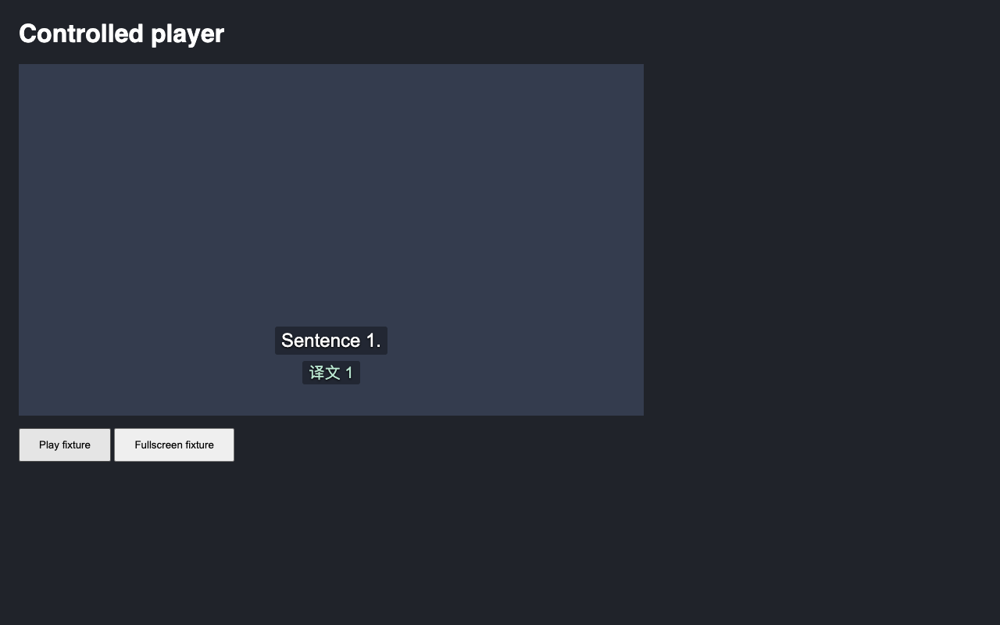
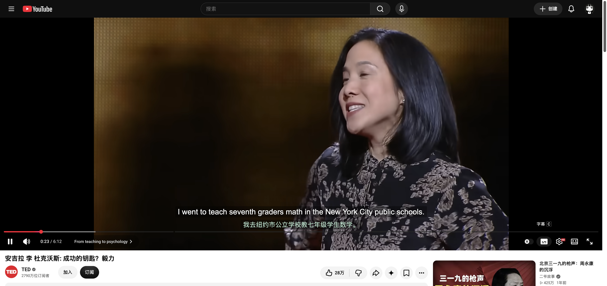
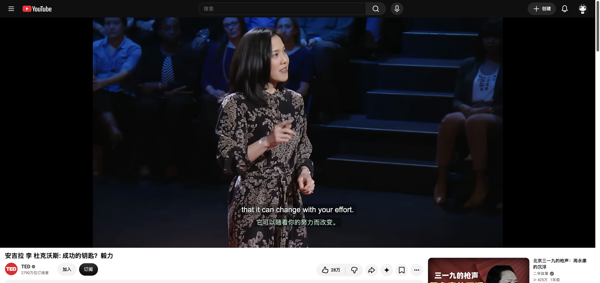

# 字幕请求按播放余量调度

旧队列按固定窗口预取四批，每批四句。窗口没有考虑播放速度和 Provider 耗时，新窗口与旧窗口不相交时还会等待旧请求结束。连续拖动会留下过期工作，落点字幕因此可能排在旧请求后面。

内容脚本现在只发送播放快照，包含视频时间、播放速度和字幕的起止区间。后台的纯函数 `planPlayback` 统一决定请求内容，时间余量为 `(cue.start - time) / max(rate, 0.25)`。余量不足的字幕单独请求，余量足够且字幕时间相近时，每批最多四句。一次计划最多十六句，通常覆盖两个预测请求耗时。内容脚本提供未来六十秒内、最多二十四个字幕输入，每视频秒刷新一次计划。

耗时预测优先使用相同输入句数的最近八个成功请求，取中位数。没有同句数样本时使用最近八个成功请求，没有任何样本时使用四秒。预测值限制在二至十二秒，单次慢请求不会决定后续所有批次的大小。

所有字幕请求合计最多两个在途，包含可见字幕请求和已经分配控制器、仍在等待 transport 的请求。可见字幕优先取得下一个空位，transport 原有的每秒最多三次 POST 限制继续生效。

拖动仍保留四百毫秒的稳定等待。`prefetch-hold` 清除旧可见字幕占位并阻止新请求，只保留已经发送、实际字幕区间覆盖落点的工作。未发送的工作立即移除，拖动期间释放的空位也不能发新包。新快照移除过期的可见字幕占位，暂停标签页不能借其他播放标签页发包。DOM 字幕在新可见请求到达时恢复调度，离开页面或销毁控制器时释放消费者。重叠字幕使用实际显示的组合区间，相同文本之间的静默间隔保留。

超时仍不重试，也不暂停队列。Provider 继续在同一个请求中拆分长句，译文就绪后才显示对应原文，非流式响应和缓存行为保持原有规则。

## 自动验证

`npm run verify` 通过 lint、类型检查、测试发现、372 个单元测试、构建和 52 个端到端测试。`npm run format:check` 和 `git diff --check` 通过。

新增端到端用例使用实际打包扩展、service worker 和 HTTP fixture。在 1.5 倍速下，开播先发两个紧急单句；连续拖到 28.8、44.8、60.8 秒，每次间隔一百毫秒，期间没有新增 POST；稳定后请求落点的两个单句。用例还检查 trace 的播放速度、在途数量和 `atRisk`。单元测试覆盖规划上限、延迟样本、暂停、多标签页、旧占位清理、DOM 消费者释放和重叠字幕区间。

同一新增用例在旧 `main` 的 `7a19de1` 构建上失败。旧版实际发出四批、每批四句，与两个紧急单句的断言不符。已保留 [旧版请求内容](assets/slack-scheduler-before-requests.json) 和 [新版 trace](assets/slack-scheduler-after-trace.json)。fixture 在截图时主动扣住响应，因此旧版等待画面只说明测试现场，不能用于量化真实 Provider 延迟。

| 旧版测试现场                                       | 新版开播                                                  | 新版拖动落点                                              |
| -------------------------------------------------- | --------------------------------------------------------- | --------------------------------------------------------- |
|  |  |  |

短视频记录请求等待和拖动恢复过程：[旧版](assets/slack-scheduler-before.webm)、[新版](assets/slack-scheduler-after.webm)。

## 用户 Chrome 验证

通过 [chrome-debug skill](../../.cursor/skills/chrome-debug/SKILL.md) 在用户已登录的 Chrome 中重新加载主仓库的 `dist`，测试 YouTube 视频 `H14bBuluwB8`。媒体保持静音，实际播放速度为一倍。连续跳到 80、160、240、280 秒，每次间隔一百毫秒，落点后译文恢复。

重连前的两轮真实浏览器检查均通过。最近一轮页面始终可见，译文出现后开播采样十五秒，拖动后采样二十秒。

| 采样               | 播放速度 | 字幕时间覆盖率 | 未就绪句数 | 最大计时延迟 |
| ------------------ | -------- | -------------- | ---------- | ------------ |
| 开播译文出现后     | 1        | 99.9%          | 0          | 0.1 秒       |
| 拖动落点译文出现后 | 1        | 100%           | 0          | 0.1 秒       |

两次 `wait-overlay` 都等待约 8.1 秒，首个 Provider 请求耗时 7.6 秒。更早一轮的首请求耗时约 14.47 秒。这些短采样不涵盖冷启动等待，也不代表整段视频的同步表现。1.5 倍速行为由确定性端到端用例验证，真实 Chrome 没有修改播放速度。

调度 trace 新增 `videoTime`、`playbackRate`、`start`、`end`、`predictedMs`、`slack`、`inFlight`、`blocked`、`atRisk`。Chrome CLI 保留这些字段，并按字幕与请求的时间区间关联 batch ID，同时兼容旧的段编号。重连后再次检查开播和拖动，所有请求都包含新增字段，在途数量不超过二，采样字幕都关联到非空 batch ID。

最后一轮的开播、落点采样页面可见比例分别为 0.46、0.17，CLI 都标记为 `throttled`。对应覆盖率为 100%、97.5%，未就绪句数为零，最大计时延迟为零、0.4 秒。后台节流还把连续跳转的实际耗时拉长到 3.2 秒，因此该轮只用于验证 trace，没有纳入上表的同步数据。前台采样和最后一轮的统计、请求字段及字幕关联保存在 [Chrome 验证数据](assets/slack-scheduler-live-summary.json)。
