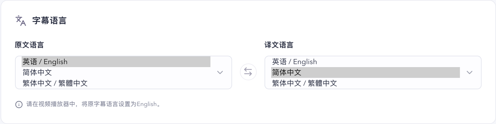

# 长句改为本地断行，语言只保留中英文

改动前，超过 80 列的句子由 Provider 断句。提示词要求模型把原文逐字抄进每一段的 `source`，扩展再把这些 `source` 对齐回原文，对不上就整句显示。长句的回复因此要把原文再写一遍。以测试用的三行长句为例，旧格式的回复是 410 个字符，新格式是 99 个字符。语言选项有 15 种，句末判断只有一套规则，各语言的标点混在同一个正则里。

## 改动

语言只保留英语、简体中文和繁体中文。已保存的设置如果用了被移除的语言，读取时换回默认语言；换回后如果原文和译文相同，就把换掉的那一项改成另一种语言。例如原文简体中文、译文日语的设置，会变成原文简体中文、译文英语。

| 改动前                                         | 改动后                                        |
| ---------------------------------------------- | --------------------------------------------- |
|  |  |

新增 `src/shared/segmenter`。各语言实现同一个接口 `LanguageSegmenter`，`sentenceEnds` 返回句末位置，`lines` 把长句断成显示行；`segmenterFor(language)` 按原文语言选择实现。

- 英文按 `.!?` 断句，跳过 Mr.、e.g.、3.30 这类缩写和小数。子句标点是逗号、分号、冒号、省略号和破折号。按词断行时在空格处断开，优先断在 and、because、which 这类连词前，尽量不断在 the、to、my 这类词后。
- 简体中文和繁体中文按 `。！？` 及后面的引号断句。子句标点是 `，、；：`、省略号、破折号，以及汉字之间的空格。按词断行时用 `Intl.Segmenter`（分别是 `zh-Hans` 和 `zh-Hant`），优先断在"但是、因为、所以"这类连词前，行首不放标点和"的、了、吗"这类助词。两者只有连词表、助词表和分词区域不同。

`lines` 的步骤对所有语言相同：

1. 在子句标点处切开。不到 12 列的子句并入相邻子句，避免"Well,"这样的短行一闪而过。
2. 仍超过 80 列的子句按词切开，切成尽量少、宽度尽量平均的几行。
3. 相邻两段合起来不超过 80 列时放在同一行。

单个词就超过 80 列时（例如长网址），这个词单独一行。

Provider 请求里，长句改为发送已经切好的行，模型逐行返回译文。请求的 user 消息：

```json
[{ "id": 0, "text": "Short sentence." }, { "id": 1, "parts": ["first line,", "second line."] }]
```

模型的回复：

```json
{ "results": [{ "id": 0, "translation": "短句。" }, { "id": 1, "parts": ["第一行，", "第二行。"] }] }
```

提示词去掉了断句、抄写原文和列宽的要求，任务部分从 1,493 个字符减到 582 个字符，整个 system 消息从 1,839 个字符减到 928 个字符。译文行数和原文行数一致时逐行显示。模型只返回一条译文时整句显示。其他行数视为无效，和以前一样单独重试一次。扩展不再需要把模型抄写的原文对齐回字幕，`caption-translation.ts` 删掉了这部分代码。

## 自动验证

`npm run verify` 通过 lint、类型检查、测试发现、384 个单元测试、构建和 53 个端到端测试。新增的 `tests/segmenter.test.ts` 覆盖英文、简体中文和繁体中文的断句和断行；端到端测试里原来的法语字幕轨换成了繁体中文字幕轨。

## 真实 Chrome 验证

通过 [chrome-debug skill](../../.cursor/skills/chrome-debug/SKILL.md) 在用户已登录的 Chrome 中交替加载旧版 `8620dbf`（构建 `6a634a9fae60`）和新版（构建 `5e8f71971a54`）。每次切换构建都会重新加载扩展，会话缓存随之清空，所以两版在同一倍速下测同一段视频。指标按 [AGENTS.md](../../AGENTS.md) 的 Verifying 一节计算。每轮拖动一次，立即记录 45 秒落点 trace，播放不中断，再记录 180 秒播放 trace。下表所有 trace 报告的倍速都等于目标倍速，没有被标记为 `throttled`，落点 trace 都从拖动目标后 4 秒视频时间内开始。媒体保持静音，每个倍速两版轮流先测。

YouTube 用四段 TED 演讲，测量片段里超过 80 列的句子分别占 17/38、21/38、18/26 和 20/47。HBO Max 用《老友记》"The One with the Thumb"，台词大多是短句。

| 网站    | 倍速  | 视频 / 落点           | 构建 | Loading while playing | Wait after seeking | Loading after seeking | 整句错过 | 请求（中止 / 无效） | Provider 耗时 p50 / p90 |
| ------- | ----- | --------------------- | ---- | --------------------- | ------------------ | --------------------- | -------- | ------------------- | ----------------------- |
| YouTube | 1x    | `arj7oStGLkU` 300 秒  | 旧版 | 0%                    | 0.0 秒             | 21.1%                 | 0 / 28   | 34（2 / 0）         | 7.7 / 14.7 秒           |
| YouTube | 1x    | `arj7oStGLkU` 300 秒  | 新版 | 0%                    | 0.0 秒             | 5.8%                  | 0 / 28   | 33（1 / 0）         | 2.9 / 5.8 秒            |
| YouTube | 1.25x | `c0KYU2j0TM4` 600 秒  | 旧版 | 0%                    | 9.1 秒             | 62.8%                 | 0 / 32   | 32（4 / 0）         | 7.7 / 12.0 秒           |
| YouTube | 1.25x | `c0KYU2j0TM4` 600 秒  | 新版 | 0%                    | 0.6 秒             | 2.2%                  | 0 / 32   | 33（1 / 0）         | 2.9 / 4.4 秒            |
| YouTube | 1.5x  | `D9Ihs241zeg` 600 秒  | 旧版 | 4.0%                  | 7.7 秒             | 82.4%                 | 2 / 62   | 29（3 / 2）         | 9.7 / 19.8 秒           |
| YouTube | 1.5x  | `D9Ihs241zeg` 600 秒  | 新版 | 0%                    | 3.6 秒             | 42.9%                 | 0 / 64   | 32（1 / 0）         | 3.3 / 7.5 秒            |
| YouTube | 2x    | `qp0HIF3SfI4` 750 秒  | 旧版 | 13.7%                 | 13.4 秒            | 50.4%                 | 3 / 61   | 33（4 / 0）         | 5.2 / 10.6 秒           |
| YouTube | 2x    | `qp0HIF3SfI4` 750 秒  | 新版 | 0%                    | 6.2 秒             | 76.6%                 | 0 / 60   | 34（2 / 1）         | 3.2 / 4.2 秒            |
| HBO Max | 1x    | 120 秒                | 旧版 | 0%                    | 14.1 秒            | 39.0%                 | 0 / 77   | 34（3 / 1）         | 2.9 / 7.5 秒            |
| HBO Max | 1x    | 120 秒                | 新版 | 0%                    | 9.9 秒             | 28.0%                 | 0 / 77   | 34（2 / 0）         | 2.8 / 6.1 秒            |
| HBO Max | 1.25x | 420 秒                | 旧版 | 0%                    | 1.2 秒             | 20.3%                 | 0 / 72   | 39（3 / 1）         | 2.9 / 4.9 秒            |
| HBO Max | 1.25x | 420 秒                | 新版 | 0%                    | 1.4 秒             | 3.6%                  | 0 / 72   | 35（2 / 1）         | 2.8 / 5.7 秒            |
| HBO Max | 1.5x  | 720 秒                | 旧版 | 0%                    | 3.9 秒             | 46.4%                 | 0 / 68   | 48（8 / 4）         | 2.9 / 6.5 秒            |
| HBO Max | 1.5x  | 720 秒                | 新版 | 0%                    | 3.4 秒             | 10.7%                 | 0 / 70   | 34（5 / 2）         | 3.6 / 8.3 秒            |
| HBO Max | 2x    | 1020 秒               | 旧版 | 2.2%                  | 1.7 秒             | 3.7%                  | 4 / 74   | 40（5 / 2）         | 2.6 / 5.1 秒            |
| HBO Max | 2x    | 1020 秒               | 新版 | 0%                    | 2.4 秒             | 5.8%                  | 0 / 74   | 33（3 / 1）         | 2.6 / 3.8 秒            |

请求数从拖动后开始统计，包含落点 45 秒和播放 180 秒。"无效"指回复里有句子不可用、需要单独重试的请求。

YouTube 的 Provider 耗时中位数在四个倍速下从 5.2–9.7 秒降到 2.9–3.3 秒，p90 从 10.6–19.8 秒降到 4.2–7.5 秒。这几段演讲里近一半句子超过 80 列，旧版这些句子的回复要多写一遍原文。耗时下降后，新版在四个倍速下播放时都没有出现"翻译中"，整句错过从 5 句降到 0 句；旧版在 1.5x 和 2x 下分别有 4.0% 和 13.7% 的时间显示"翻译中"。拖动后首句等待在 1.25x、1.5x、2x 下从 9.1、7.7、13.4 秒降到 0.6、3.6、6.2 秒。

2x 那组新版的 Loading after seeking 高于旧版（76.6% 对 50.4%）。这项占比的分母是显示"翻译中"和显示译文的时间之和，两次落点 trace 里只有 6.4 秒和 13.7 秒。新版落点后第二句的单句请求发出 6.1 秒还没有返回，那句已经结束，请求被中止，下一句才显示译文。

这次没有统计 HBO 片段的长句比例，《老友记》的台词大多是短句，两版 Provider 耗时接近。拖动后首句等待在 1x 下从 14.1 秒降到 9.9 秒，其他倍速两版相差不到 1 秒。新版在 1x、1.25x、1.5x 下落点"翻译中"占比较低，2x 下两版都在 6% 以内。旧版 2x 播放时有 2.2% 的时间显示"翻译中"、错过 4 句，新版没有。无效请求从 8 个降到 4 个。

X 的视频太短，只跑 chrome-debug 的冒烟检查。旧版和新版都通过，`overlay` 步骤分别等了 16.1 秒和 9.1 秒看到译文，这是单次结果。

### 没有计入的运行

2x 的 YouTube 一开始在 `qp0HIF3SfI4` 600 秒测了两版，都没有计入。YouTube 在 2x 下拖动后缓冲时，chrome-debug 的 `media` 步骤每次轮询都检查视频是否离目标超过 1.5 秒，超过就重新拖动。视频一恢复播放就会走过这个范围，结果两版分别出现了 89 次和 66 次拖回 600 秒的 `seeking` 事件，旧版那一步 90 秒后超时。之后改用一次 `evaluate` 设置 `currentTime` 来拖动。第二次在 300 秒测时，脚本先等视频走过 301 秒再开始 trace，两版的落点 trace 分别晚了 3.6 秒和 3.9 秒，首句译文这时已经到了，首句等待只测到 0.0 秒和 0.6 秒，也没有计入。上表 2x 的 YouTube 数据来自第三次，两版的落点 trace 都从 750.0 秒开始，各只拖动一次。`media` 步骤在高倍速下重复拖动的问题这次没有改。

用 `media` 步骤拖动的运行里，有些在拖动后 2–4 秒又出现一次拖回同一目标的 `seeking` 事件，发生在落点 trace 开始之前。YouTube 1x 到 1.5x 的 6 次运行都有，HBO 有 5 次（旧版 2 次，新版 3 次）。HBO 打开页面时还有一次网站自己的续播跳转。

测量之后，`caption-translation.ts` 里两个读取函数改了写法，行为不变。最终提交的构建 `e25876151de7` 重新跑了 `npm run verify` 和 YouTube、HBO Max、X 三项冒烟检查，全部通过。每轮的指标和请求统计保存在 [验证数据](assets/local-line-splitting-summary.json)。
