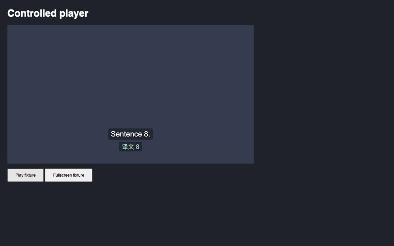

# 字幕请求改为按缓冲提前规划

[按播放余量调度](2026-10-08-playback-slack-scheduler.md) 合并后，正常播放时字幕经常显示"翻译中"。真实 Chrome 前台测试 YouTube `iG9CE55wbtY` 的 710–890 秒，有译文的字幕时间只有 69.5%，43 句里 8 句整句没赶上。原因有四个：

1. 规划范围是单句中位耗时的两倍，实测只有 4–12 秒。同一个 Provider 的耗时 p90 为 11.5 秒，最长 18 秒，24 个成功请求里 8 个晚到。
2. 只有首句余量大于预测耗时才合并，字幕又随规划范围逐句进入，34 个请求里 18 个是单句。
3. 每秒刷新快照时，不在新计划里的已发请求会被中止。34 个请求里 10 个被中止，其中 3 个发出 1–2 秒就被中止，当时还有 8.6–11.9 秒余量。
4. 落后之后所有句子都只能单发，屏幕上那句又排在最前，名额花在注定赶不上的句子上。

两轮真实浏览器测试还显示，单个请求覆盖的视频时间越长，耗时越长：

| 单个请求覆盖的视频时间 | 请求数 | 耗时中位数 | 耗时至少 10 秒的比例 | 最长  |
| ---------------------- | ------ | ---------- | -------------------- | ----- |
| 少于 5 秒              | 45     | 2.2 秒     | 2%                   | 18 秒 |
| 5–10 秒                | 48     | 4.4 秒     | 14%                  | 21 秒 |
| 10–20 秒               | 14     | 6.5 秒     | 28%                  | 19 秒 |
| 20–60 秒               | 3      | 12.4 秒    | 100%                 | 59 秒 |

## 新规则

`planPlayback` 只接收快照里还没翻译、也没分配到请求的句子。

1. 提前请求未来 max(30 秒, 3 × 近期耗时 p90) 的播放时间，按播放速度换算成视频时间。p90 取最近 32 次成功请求，没有样本时按 8 秒算。
2. 每个请求最多四句，从首句开始到末句结束不超过 10 秒视频。快照末尾还能再装句子的包，首句离播放点不到两倍 p90 时才发，避免窗口边缘逐句发包。
3. 首句余量小于最近 8 次耗时的中位数时，单独请求这一句。1 秒内就要离开屏幕的句子不进计划，由屏幕字幕的请求兜底；屏幕字幕仍然优先取得下一个空位。
4. 正常播放时，只要句子还在快照里，已经分配的请求就不取消。拖动处理不变：`prefetch-hold` 只保留覆盖落点的已发请求，落点稳定 400 毫秒后才重新规划。

在途上限仍是两个，transport 的每秒三次 POST 限制不变。

和提案阶段在真实 Chrome 里测过的原型相比，正式实现改了四处：

- 原型不请求结束时间早于"当前时间加中位耗时"的句子。开播时没有样本，按默认 4 秒计算会让视频第一句完全不请求，正式实现改为 1 秒。
- 原型把屏幕字幕排在计划请求之后。如果屏幕字幕不在计划里（例如文本与时间轴对不上），排在后面会拖慢本来来得及的句子，正式实现保留它的优先级。
- 原型按句子时长之和限制每包内容，长停顿之后的句子也可能装进同一个包；正式实现改为限制视频跨度。
- 末尾不满的包，原型等到首句离播放点不到两倍中位耗时；正式实现改为两倍 p90，避免在长尾较重时把发送推迟到接近截止。

## 自动验证

`npm run verify` 通过 lint、类型检查、测试发现、373 个单元测试、构建和 53 个端到端测试。`npm run format:check` 通过。

新增端到端用例 `steady playback stays ahead of a Provider whose every fourth reply takes 15 s` 使用打包扩展、service worker 和 HTTP fixture。Provider 每个请求 3 秒后回复，每第四个请求 15 秒后回复，视频以 1 倍速连续播放到 60 秒。用例要求第二句开始后不出现"翻译中"、没有请求被中止。同一用例加载 `7708ec0` 的构建时失败：

| 4–60 秒                | 旧版 `7708ec0`  | 新版 |
| ---------------------- | --------------- | ---- |
| 显示"翻译中"的字幕时间 | 13.3%（7.3 秒） | 0%   |
| 请求数                 | 17（16 个单句） | 11   |
| 被中止的请求           | 3               | 0    |

旧版在 28.4、44.4、60.3 秒各有一整句停在"翻译中"，都紧跟在一个 15 秒的回复之后。下图是两次录像中同一视频时刻的画面。

| 旧版                                                    | 新版                                                   |
| ------------------------------------------------------- | ------------------------------------------------------ |
|  |  |

录像：[旧版](assets/buffer-plan-steady-before.webm)、[新版](assets/buffer-plan-steady-after.webm)。

1.5 倍速用例改为新的请求形状：开播先单发屏幕上的句子，再发两句一包；连续拖动期间不发新包，落点先单发落点句子，再发后面两句。
